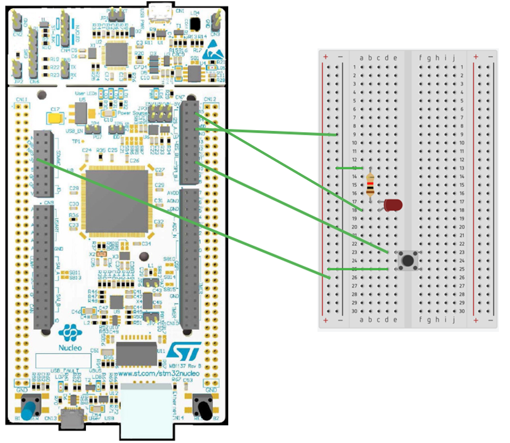

# STM32 Project - LED 與按鈕

這是一個用於 STM32F4 系列微控制器的示例項目，旨在使用按鈕點亮 LED 。

## 硬件要求

- STM32F429ZIT6 微控制器
- LED
- 電阻（適當的歐姆值）
- 按鈕

## 軟件依賴

- STM32CubeMX
- Keil MDK v5

## 學習目標

- GPIO 輸入函式

## 電路圖

## 構建和編譯

1. 在 Keil MDK 中打開 MDK-ARM\LED and BTN.uvprojx
2. 編譯並燒寫至您的微控制器

## 使用方法

將編譯好的程序燒寫到 STM32 微控制器後，按下按鈕時，LED 應該會發亮。
